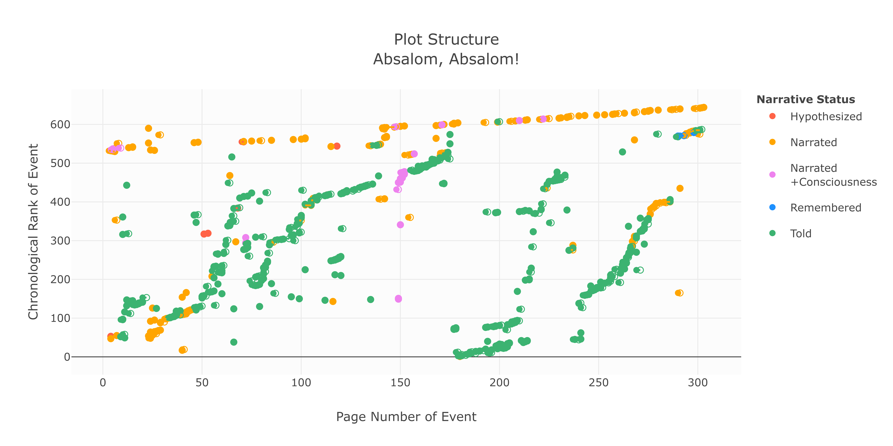

```{r setup, include=FALSE, message = FALSE, warning=FALSE, error=FALSE}
knitr::opts_chunk$set(echo = FALSE, message = FALSE, warning=FALSE, error=FALSE, tidy='styler')
```

#### Load Libraries
```{r load_packages}
library(tidyverse)
library(tidytext)
library(stringi)
library(scales)
library(stringr)
library(plotly)
library(textstem)
library(shiny)
library(lubridate)
library(htmlTable)
```

#### Load texts
```{r load_text}
#Read in the text
absalom_df <- as.data.frame(read_file("absalom_cleaned_to_match_4_30_rev4.txt"))
colnames(absalom_df) <- "text" 

absalom_df <- absalom_df %>% 
mutate(text = gsub("[‘’]", "'", text))
```

```{r _load_event_sentences}
absalom_event_sentences <- read_csv("absalom_event_sentences_clean_2021_5_10.csv")

#This file was created by recomposing the text based on the "First Words" column and matching the text segments with each event using a copy of the text. As this process is quite involved it has been branched out into a separate file: absalom_sentiment_text_processing. Full details on the process can be viewed there.

```


```{r absalom_event_word_count}
event_length <- absalom_event_sentences %>%
  mutate(event_words = str_count(event_sentence,  "\\S+")) %>%
  select(EventID, begin_word, end_word, event_sentence, event_words)
```


```{r read_all_absalom_events}
absalom_all_events <- read_csv("absalom_all_events_2021_5_11.csv")
```

```{r event_dates}
aa_event_dates <- read_csv("absalom_event_dates_05_15.csv")

aa_event_dates <- aa_event_dates %>% 
                  mutate(StartDate=str_trim(StartDate)) %>% 
                  mutate(EndDate= str_trim(EndDate)) %>% 
                  select(EventID, StartDate, EndDate) %>% 
                  drop_na()
```


```{r chapter_numbers}
chapter_numbers <- read_csv("chapter_numbers.csv")

```

```{r clean_up_absalom_events}
#The full table is long and hard to work with. 
absalom_events_short <- absalom_all_events %>%
  select(3:8,11, 13, 21:28, 34, 50, 52:54) %>% 
  mutate(narrator = str_extract(Summary, "(?<=(SOURCE)).+[^]</p>]")) %>% 
  mutate(narrator = str_replace_all(narrator,":","")) %>% 
  left_join(event_length, by="EventID") %>% 
  left_join(chapter_numbers, by = "PageNumber") %>% 
  left_join(aa_event_dates, by="EventID") %>% 
  relocate(StartDate, .after = NarrativeStatus) %>% 
  relocate(EndDate, .after= StartDate)
```


```{r read_all_DY_events}
dy_events <- read_csv("full_database_2021_5_11.csv")

```

```{r clean_up_all_events}
dy_events_short <- dy_events %>% 
                    select(1:11, 21:27, 50, 52:54)


```


```{r load_race_words}
#Read in the race words
race_words <- read_csv("race_words.csv")
```

#### Load Chart Vars

```{r load_color_scheme, echo=FALSE}
#Page styling

#This is where you create your own custom color palette for the traces.
faulkner_colorway = c("#132C53","#F27A18","#ae0700","#79b473","#38726c","#76bed0","#6b2d5c","#448b2d","#e6d812")

#This controls the background color for the entire chart. Probably best left white.
faulkner_paperbackground = c('rgba(255,255,255,0)')

#This controls the background for the plot. Probably best left white.
faulkner_plotcolor = c('rgba(255,255,255,.3)')

#Margin 

m <- list(l = 50, r = 50, b = 50, t = 50, pad = 4)

#Caption Style

fig_caption <- "font-family: 'Open Sans','Helvetica Neue',Helvetica,Arial,sans-serif; font-weight: normal; font-size:90%"

plot_font <- list(
  family = "'Open Sans','Helvetica Neue',Helvetica,Arial,sans-serif",
  size = 14,
  color = '#363636')


```


## Introduction


### Overview

The following piece uses several techniques available to standard CL analysis, alongside a more complex analysis exclusively available to practitioners who have access to the [*Digital Yoknapatawpha*](http://faulkner.iath.virginia.edu/) data set. These different techniques have been split into their own sections. 

- **Part 1: Characters**  
          
- **Part 2: Locations**  
          
- **Part 3: Events**  

- **Part 4: Text**  


  The *DY* database provides insight into what characters are where and at what time. Using this database, it is possible to reconstruct the language surrounding people, places, and times.^[All of the data was generated in the R programming language using the `tidyverse` suite of packages for the calculations and the `plotly` library for the graphics. The full repository is available at https://github.com/joostburgers/absalom_sentiment_analysis Due to copyright issues the repository does not include the *Absalom, Absalom!* text file used for data analysis. The text file used for text analysis was the 2011 Vintage Edition [@faulkner2011], which corresponds with the 1990 edition we used for *DY*]


## Part 1: Characters

A common description of *Absalom, Absalom!* is that it is not a whodunit, but rather a why-done-it. Within the first several pages, the basic facts of the case are laid out: Henry Sutpen shoots his sister's fiance, Charles Bon, on the day of their wedding. The remainder of the narrative is dedicated to unspooling the various lines of inquiry into why Henry was motivated to shoot Bon. The answer is as integral to the Sutpen family story as it is a synecdoche of the larger history of slavery in America. In many respects then, *Absalom, Absalom!* is a character study. Faulkner sketches out a few basic details about the Sutpen family, and leaves it to the various narrators to infer cause and effect based on the motivations of the various characters. 

To understand all of these various social relations, it is useful to think through not only the individual characters, but the larger demography of the text. *Digital Yoknapatawpha* is particularly useful in this regard. Not only can users pull up the biographies of each individual character, it is also possible to "slice" and "drill-down" into the data to render a more detailed portrait of the various characters in relation to one another. 


```{r general_overview}
#Unique Characters
unique_characters <- absalom_events_short %>%
  distinct(CharacterName)

#Characters based on rank
peripheral_characters <- absalom_events_short %>%
  filter(PresentMentioned == "Present") %>%
  distinct(CharacterName, .keep_all = TRUE) %>%
  count(Rank) %>%
  mutate(percent = n / sum(n))

#Events in which Judith Sutpen is present
Judith_events <- absalom_events_short %>%
  filter(PresentMentioned == "Present") %>%
  filter(CharacterName == "Judith Sutpen")

#All characters surrounding Judith
Judith_unique_all <- absalom_events_short %>%
  semi_join(Judith_events, by = "EventID") %>%
  filter(PresentMentioned == "Present") %>%
  distinct(CharacterName, .keep_all = TRUE) %>%
  filter(CharacterName != "Judith Sutpen")

#All minor and peripheral characters surrounding Judith
Judith_unique <- Judith_unique_all %>%
  filter(Rank %in% c("Peripheral", "Minor")) %>%
  distinct(CharacterName)

#Ration major minor characters DY
character_ranks <- dy_events_short %>%
  filter(PresentMentioned == "Present") %>%
  distinct(CharacterName, .keep_all = TRUE) %>%
  count(Rank) %>%
  mutate(percent = n / sum(n)) %>% 
  arrange(Rank)

#Events in which Henry Sutpen is present
Henry_events <- absalom_events_short %>%
  filter(PresentMentioned == "Present") %>%
  filter(CharacterName == "Henry Sutpen")

#All characters surrounding Henry
Henry_unique_all <- absalom_events_short %>%
  semi_join(Henry_events, by = "EventID") %>%
  filter(PresentMentioned == "Present") %>%
  distinct(CharacterName, .keep_all = TRUE) %>%
  filter(CharacterName != "Henry Sutpen") %>% 
  nrow()

#Events in which Thomas Sutpen is present
Thomas_events <- absalom_events_short %>%
  filter(PresentMentioned == "Present") %>%
  filter(CharacterName == "Thomas Sutpen")

#All characters surrounding Thomas
Thomas_unique_all <- absalom_events_short %>%
  semi_join(Thomas_events, by = "EventID") %>%
  filter(PresentMentioned == "Present") %>%
  distinct(CharacterName, .keep_all = TRUE) %>%
  filter(CharacterName != "Thomas Sutpen") %>% 
  nrow()
                    
```

Although much of the text is heavily focused on the Sutpen family, its world is actually peopled by `r nrow(unique_characters)` unique characters. The overwhelming majority of these (`r percent(peripheral_characters$percent[2]+peripheral_characters$percent[3])`) are peripheral or minor characters. While the abundance of minor characters in *Absalom, Absalom!* comports with the ratio of major and minor characters in Faulkner's texts more generally, it is an important reminder that while the Sutpens may be secluded, they are not isolated from the larger world.^[The overwhelming majority of characters in Faulkner's texts, and likely most novels are minor (`r percent(character_ranks$percent[2])`). Major (`r percent(character_ranks$percent[1])`) or secondary (`r percent(character_ranks$percent[4])`) characters necessarily make up a much smaller share, because the narrative can only focus so much attention on particular characters. Peripheral characters make up a small share as well peripheral characters (`r percent(character_ranks$percent[3])`), but the functional difference between these characters and minor characters is negligible.] This relationship between the Sutpen's and the wider world is important in considering how much social pressure there would have been for them to conform to mores and habits of the time. Barring Clytemnestra, Judith is probably the most sheltered of the Sutpens. Yet even she makes the 12 mile journey to town "twice and sometimes three times a week" during her youth (54). Over the course of the novel she appears in events with `r nrow(Judith_unique_all)` characters, `r nrow(Judith_unique)` of whom are minor or peripheral characters, some of whom have a modicum of social status, such as Colonel Sartoris and Theophilus McCaslin. Mr. Compson's description of her as a "countrybred girl" (79) is therefore not inaccurate. Nevertheless, these connections to the larger social landscape of the town, speaks to the fact that Judith is not immune from communal opprobrium, even if she is the daughter of the area's wealthiest planters and lives at some remove from town. Beyond Judith, the men on the Sutpen plantation have far richer social connections, Thomas meets `r Henry_unique_all` characters, while Henry is connected to different `r Thomas_unique_all` characters. Though certainly an eccentric family, they are deeply woven into the social fabric of the town.

The potential source of condemnation by the community is, of course, her desire to marry Charles Bon who may be her half-brother and also part Black. It almost goes without saying that incest would have caused widespread indignation at any point in history, even if Henry tries to rationalize to himself by claiming, "There was that Lorraine duke named John something that married his sister" (273). It might be harder to understand why Bon's possible Black ancestry would be an issue if he is, by all appearances, White. Up until Loving vs. Virginia in 1967, the state of Mississippi legally enforced its prohibition on "interracial" marriage, something that was not removed from the state's constitution till 1987 (ROMANO 250). Suffice to say, that Bon's attempt to marry a White woman at the very end of the Civil War would have provoked community outrage and reprisal. What's more the issues of incest and "miscegenation" were often seen as two sides of the same coin, as they were both crimes of "blood" (SAKS 71).
These stark divisions between Black and White are reflected in important but slightly diifferent ways in the basic demographics of the real Lafayette County and Faulkner's fictional Yoknapatawpha. In his thorough historical account of Lafayette, Don Harrison Doyle shows that the ratio of Black (40%) and White (60%) identified people in the county was relatively stable throughout the county's history. There is no room for people who do not fit either category neatly. In his own maps of Yoknapatawpha Faulkner actually flips this ratio and claims that there are 6,298 Whites and 9313 "Negroes." 

```{r black_white_ratios}

all_characters <- dy_events_short %>%
  distinct(CharacterName) %>%
  nrow()

black_white_all <- dy_events_short %>%
  # filter(SourceTextCode!="AA") %>%
  distinct(CharacterName, .keep_all = TRUE) %>%
  count(Race) %>%
  mutate(percent = n / sum(n))

#This turned out to be a not all that relevant statistic.
black_white_pre <- dy_events_short %>%
  filter(SourceTextCode!="AA") %>%
  filter(Era %in% c("Antebellum (1831-1860)", "Pre-Removal (-1830)")) %>%
  distinct(CharacterName, .keep_all = TRUE) %>%
  count(Race) %>%
  mutate(percent = n / sum(n))
```

```{r count_char}
char_count_AA <- absalom_events_short %>%
  distinct(CharacterName, Race) %>%
  count(Race)  %>%
  mutate(percent = n / sum(n))
              
```

He does not mirror this ratio in his fiction though. If we look at all `r comma(all_characters)` characters, there are significantly more White characters, `r comma(black_white_all$n[10])` (`r percent(black_white_all$percent[10])`) than there are Black characters `r comma(black_white_all$n[2])` (`r percent(black_white_all$percent[2])`). The only other racial group are the `r comma(black_white_all$n[4])` Native Americans who appear sporadically across the fiction and make up only (`r percent(black_white_all$percent[4])`) of the characters. Thus, even though much of Faulkner's work explores race, it does so from a decidedly White perspective. There is little room for characters who are not white, and even less room for characters like Sutpen's first wife, Charles Bon, Bon's "octoroon" wife, Clytemnestra, Charles Etienne de Saint Valery Bon, and Jim Bond, all of whom have Black and White ancestry. They only constitute `r percent(black_white_all$percent[6])` of Yoknapatawpha's larger social world and `r percent(char_count_AA$percent[4])` in *Absalom, Absalom!*. These characters disrupt the ostensible stable racial categories of Native American, Black, and especially White that make up the unbalanced demography of Yoknapatawpha. No wonder then that Judith's possible marriage to someone outside of this rigid social order would cause such anxiety.

```{r weight_count}
weight_count <- absalom_events_short %>%
  filter(PresentMentioned == "Present") %>%
  distinct(EventID, Race, event_words) %>%
  group_by(Race) %>%
  summarize(word_total = sum(event_words)) %>%
  mutate(percent = word_total / sum(word_total))
```

This point is further amplified when character presence is taken into consideration. Using the event data, it is possible to calculate how often a individual character is present and for how long.^[This was done by counting the number of words by event.] By that same token, we can calculate the "screen time" for each different race group in *Absalom, Absalom!*. Quite revealing is the fact that even though they are a demographic minority, characters with heterogeneous ancestry are present in `r percent(weight_count$percent[3])` of the text and are thereby the second most present characters after White characters (`r percent(weight_count$percent[5])`). One way to read the predominance of these characters, is Faulkner's attempt to trouble the color line. By collapsing the ostensibly natural boundary between "Black" and "White," Faulkner exposes the very constructedness of those boundaries. Charles Bon is able to win the affections of Judith and Henry by passing as White, and only when his possible Black ancestry is exposed does he suddenly become a threat. Henry still thinks he is fit to marry Judith after Charles reveals that he has an "octoroon" wife and a child, and even after he discovers Charles is his half-brother. Both bigamy and incest represent a level of moral turpitude that is generally disqualifying for any union, but Henry is willing to look past these. In the end, "it's the miscegenation" that he "cant bear" (285). The fact that Henry has qualms about the possible interracial element to the marriage between his sister and Charles, but ignores others, lays bare the insidiousness of artificial racial designations, and their distortion of human relationships. 
Similarly, the text also highlights the constructedness of race through the trajectory of Charles Bon's son with the unnamed "octoroon" wife.  Charles Etienne Saint-Valery Bon also crosses the color line with a woman disparagingly described as "coal black and ape-like" (166). Like his father, he too is punished for his racial transgressions, and both Black and White see what they want to see. In the company of his soon to be wedded wife, he tells the "negro stevedores and deckhands" that he is not a white man, they "believed it only the more strongly," and when he tells "white men" that he is a "negro" they believe he "lied in order to save his skin" (167). In both cases, the confrontations end in violence. There is a deep racial irony here. Charles Bon is murdered because it is believed he might not be fully white and tries to marry a white woman, and Charles Etienne is met with violence because no one believes he might be part black, and is married to a Black woman. In these two mirror images of father and son, *Absalom, Absalom!* demonstrates the arbitrariness of the color line.

```{r}
total_present_length <- absalom_events_short %>%
  filter(PresentMentioned == "Present") %>%
  distinct(EventID, .keep_all = TRUE) %>%
  summarise(total_words = sum(event_words))

character_appearances <- absalom_events_short %>%
  filter(PresentMentioned == "Present") %>%
  #distinct(CharacterName, .keep_all = TRUE) %>%
  group_by(CharacterName) %>%
  summarize(word_total = sum(event_words)) %>%
  mutate(percent = word_total / total_present_length$total_words[1]) %>%
  filter(
    CharacterName %in% c(
      "Clytemnestra",
      "Charles Bon",
      "Charles Etienne Saint-Valery Bon",
      "Jim Bond",
      "Thomas Sutpen",
      	
"Mrs. Charles Bon|Octoroon Mistress",
      "Mrs. Thomas Sutpen(1)"
    )
  ) %>%
  arrange(CharacterName)

```

A less generous perspective is that Faulkner is not concerned with destabilizing the color line, but instead preoccupied with what racial segregation means for Whiteness. That is, if the text were truly investigating how the color line affected the white and black communities, the different trajectories of each mixed ancestry character would receive a more equal amount of attention. As it stands, Charles Etienne and his struggles with Blackness appears in only `r percent(character_appearances$percent[2])` of the text. Meanwhile, characters identified as Black, despite their diverse heritage, also receive little attention. Clytemnestra's fate is particularly cruel. Despite being Sutpen's daughter, she is continuously disassociated from the family, and is alternately described as "negro half sister" (87), "wild" (126), "without sex or age" (109), "negress" (139), or, simply, "servant" (149). She speaks maybe a handful of words and is present in only `r percent(character_appearances$percent[3])` of the text. Even more marginalized is Jim Bond, who only says four words, "Calls me Jim Bond" (297), and is present `r percent(character_appearances$percent[4])` of the time. This is in contrast to Charles Bon who receives far more attention than all three combined (`r percent(character_appearances$percent[1])`).  
The racial anxiety runs decidedly along a gendered path. Women like Clytie who are "coffee-colored" (158) are useful as servants, light-skinned women like Charles Bon's first wife are "more valuable as commodities than white girls" (93), and in the Caribbean mixed ancestry women are simply "foreigners" (203). Meanwhile, men of mixed ancestry who do not pursue White women either effete like Charles Etienne who has "light bones and womanish hands" (162), or brutes like the "hulking slack-mouthed" Jim Bond (173). Racial transgression, in all cases results in a bad end, but the most perilous path of all is the possible corruption of a White woman by a man with possible Black blood. 

For all the mystery surrounding Charles Bon, Thomas Sutpen receives by far the most narrative focus in the novel and appears in `r percent(character_appearances$percent[5])` of all the text. Arguably, the dominance of Sutpen in the text underscores the fact that the lives of mixed ancestry characters do not serve a role outside of how they affect his "design." Focusing on Sutpen and race, conjures another disconcerting specter: the reason for the design's failure. The source of his folly can be traced back to a fundamental misunderstanding regarding racial cues: he does not recognize his first wife as part Black. There is a way in which the text makes a subtle and uncomfortable argument that Sutpen does not recognized Blackness because he does not embody the proper type of Whiteness. 
Sutpen is born into very humble beginnings in the mountains of Western Virginia outside of the world of the plantation system. He is unfamiliar with race, and when he was growing up, "the only colored people were Indians and you only looked down at them over your rifle sights" (179). As his clan makes its way closer to the plantations of Virginia, it starts to dawn on him that there were differences between "white men and black ones", but also "between white men and white men" (183). Yet, he is never able to shake off these vestiges of his poor upbringing, and one of the first accusations Rosa makes against him is that "He wasn't even a gentleman" (9). Even when he is at the apex of his social status, Mr. Compson points out that his "flowering was a forced blooming" and that he was "playing the scene to an audience" (57). He can therefore never hope to permanently establish a foothold among the fine families of Yoknapatawpha: Sartoris, De Spain, Compson. His breeding is too low and his ambitions too grand for the county. Whiteness cannot be cleaved from class, and it is little surprise that Sutpen's social ambit straddles all classes equally. 

```{r sutpen_social}

Sutpen_events <- absalom_events_short %>%
  filter(PresentMentioned == "Present") %>%
  filter(CharacterName == "Thomas Sutpen")

Sutpen_unique_all <- absalom_events_short %>%
  semi_join(Sutpen_events, by = "EventID") %>%
  filter(PresentMentioned == "Present") %>%
  #distinct(CharacterName, .keep_all = TRUE) %>%
  filter(!CharacterName %in% c("Thomas Sutpen","Judith Sutpen", "Henry Sutpen", "Charles Bon", "Clytemnestra")) %>% 
  group_by(Class) %>% 
  summarise(total_words = sum(event_words)) %>% 
  mutate(percent = total_words/sum(total_words)) %>% 
  arrange(Class)

Sutpen_with_upper_class <- absalom_events_short %>%
  semi_join(Sutpen_events, by = "EventID") %>%
  filter(PresentMentioned == "Present") %>%
  #distinct(CharacterName, .keep_all = TRUE) %>%
  filter(!CharacterName %in% c("Thomas Sutpen","Judith Sutpen", "Henry Sutpen", "Charles Bon", "Clytemnestra")) %>% 
  filter(Class =="Upper Class") %>% 
  group_by(LocationTitle) %>% 
  distinct(EventID,.keep_all = TRUE) %>% 
  summarise(total_words = sum(event_words)) %>% 
  mutate(percent = total_words/sum(total_words))

```

If his descendants are not counted, Sutpen only spends `r percent(Sutpen_unique_all$percent[10])` of the text with upper class characters, the rest of the time he is with Enslaved Blacks (`r percent(Sutpen_unique_all$percent[1])`), his middle class in-laws and the French architect (`r percent(Sutpen_unique_all$percent[7])`), and lower class and "poor whites" (`r percent(Sutpen_unique_all$percent[9]+Sutpen_unique_all$percent[6])`). Even when he is with upper class men, it is always in a grotesque pantomime of class status: fighting the people he enslaved (21), the "grand" wedding to Ellen (43), or the "hunting party" for the French architect. Indeed, one way to understand his association with the "poor white" Wash Jones after the end of the Civil War is as Sutpen reverting to his own roots. Jones's shiftless existence in a dilapidated cabin on the purlieus of a grand plantation mirrors his own father's life in Tidewater, Virginia in the 1820s. Perhaps then, Sutpen's design fails because he is not the right type of White. Had he been born into status, there would have been no need to go to Haiti, and he would have married into a bloodline that would have been guaranteed to be "pure" white because the rest of the surrounding community would affirm that fact. His tragic flaw was to try to become part of a system that only allows entry at birth. The paradox, of course, is that in Northern Mississippi many of the planters who arrived in the 1830s, as Sutpen does, were not "born" into their position, they were hardscrabble men of few scruples who masked their violent rise from indigence through a veneer of gentility (RAILEY 118-119). The differences between Sutpen and the plantocracy of the town, is a difference in degree, but not in kind.


```{r death_AA}
deaths_AA <- absalom_events_short %>% 
              filter(PresentMentioned=="Present") %>% 
              distinct(CharacterName, .keep_all = TRUE) %>% 
              count(CauseOfDeath) %>% 
              drop_na() %>% 
              mutate(percent = n/sum(n)) %>% 
              arrange(CauseOfDeath)

total_deaths <- sum(deaths_AA$n)

old_age <- absalom_events_short %>% 
              filter(PresentMentioned=="Present") %>% 
              distinct(CharacterName, .keep_all = TRUE) %>% 
              filter(CauseOfDeath =="Old Age")

```


There is also a third, middle way, to read the novel. The multiple figurative and literal dead-ends can also be read as the effect of the plantation system destroying the very social relations it is aiming to maintain. Of the `r total_deaths` characters who die in the novel, only `r deaths_AA$n[3]` (`r percent( deaths_AA$percent[3])`) die of old age - Ikkemotubbe and Rosa - the rest dies by murder (`r percent( deaths_AA$percent[2])`), suicide (`r percent( deaths_AA$percent[2])`), or disease (`r percent( deaths_AA$percent[1])`). The two characters who die relatively peacefully, Ikkemottube and Rosa, are two rather poetic book-ends to survive Sutpen's tale of the destruction. The former is cheated out of his land and displaced, and the latter is cheated out of a marriage and never becomes part of her community. The fates of the protagonists are much grimmer. Charles Bon is killed by his half-brother, Judith and Charles Etienne who both transgress the color line die of "yellow fever", Clytemnestra starts the fire that kills both she and Henry - eternal prisoners physical and spiritual of Sutpen's Hundred. The only remainder of the Sutpen line is Jim Bond whose incoherent howling is a garbled rejoinder to the social system that wrought so much devastation. In the end, a system that only reproduces violence to uphold a rarified elite plantocracy is bound to collapse. To paraphrase Quentin's father, The entire Sutpen line, and the South more generally, "pays the price for having erected its economic edifice not on the rock of stern morality but on the shifting sands of opportunism and moral brigandage" (209). 


## Part 2 Locations


```{r sutpen_location}
locations <- absalom_events_short %>%
  mutate(new_location = ifelse(
    str_detect(LocationTitle, "Sutpen") == TRUE,
    "Sutpen Place",
    LocationTitle
  )) %>%
  distinct(EventID, .keep_all = TRUE) %>%
  group_by(new_location) %>%
  summarise(total_words = sum(event_words)) %>%
  mutate(percent = total_words / sum(total_words)) %>% 
filter(new_location == "Sutpen Place")

```

```{r}
sutpen_place <- absalom_events_short %>%
  mutate(new_location = ifelse(
    str_detect(LocationTitle, "Sutpen") == TRUE,
    "Sutpen Place",
    LocationTitle
  )) %>%
  filter(new_location == "Sutpen Place") %>%
  distinct(EventID, .keep_all = TRUE) %>%
  group_by(chapter) %>%
  summarise(total_words = sum(event_words)) %>%
  mutate(percent = total_words / sum(total_words)) 

```


```{r}
location_order <- absalom_events_short %>%
  filter(PresentMentioned=="Present") %>% 
  filter(CharacterName == "Thomas Sutpen") %>% 
  mutate(new_location = ifelse(
    str_detect(LocationTitle, "Sutpen") == TRUE,
    "Sutpen Place",
    LocationTitle
  )) %>%
  filter(new_location != "Sutpen Place") %>% 
  relocate(new_location, .before=1)
  

```


In terms of its characters, the narrative draws such intense focus on the main protagonists that all other characters who form part of the social fabric appear to fall by the wayside. A similar optical illusion takes place with regard to the Sutpen plantation and its connection to the wider world. True, the plantation and its environs are the central axis for a plurality of the action (`r percent(locations$percent[1])`),, but the focus on the Sutpen place is not necessarily evenly distributed across the text. The majority of events dedicated to the Sutpen plantation occur in chapters 5 and 6 (`r percent(sutpen_place$percent[5]+sutpen_place$percent[6])`), right in the heart of the narrative. It has a less central focus in other chapters. In effect, the text slowly zooms into the plantation in the early chapters and then slowly zoom's out and pans to other places as the narrative accrues more and more information, however speculative on Sutpen's putative past. 

This narrative effect is two-fold. First, by slowly drawing the reader into the plantation, it propels the narrative drive of the first part of the text, and therefore becomes the central positional axis of the narrative. The initial chapters try to answer the question: what is Sutpen's Hundred, the plantation that "this demon", Sutpen, "tore violently" (5) from the earth? The second major part of the narrative, chapters 7 and 8 trace the origin story of Sutpen's grand design, and try to piece together the why of Sutpen's Hundred. The answer to this second question, the motivation for the grand design, takes the narrative farther and farther away from from Sutpen's Hundred and Yoknapatawpha. The dual motion of a gravitational center in the first half of the work, and the locations attracted back by its pull set into motion an ever expanding orbit. Quite deliberately, the narrative sees Sutpen travel in ever-widening circles. After staying at Holston House and buying his land, he is suspected of leaving for the Mississippi River to the "steamboats full of gamblers and cotton- and slave dealers to replenish his cache" (26). Quite some time elapses before he leaves his plantation again when he travels to New Orleans to investigate Bon (82). Shortly afterwards the war breaks out, and he becomes Colonel in Virginia (100). The narrative traces Sutpen back to Virginia when Shreve and Quentin start reconstructing his past (179). From thereon he travels to Haiti (193), only to come full circle and return to Yoknapatawpha. Even a fairly crude understanding of geography notes the ever increasing distances Sutpen's narrative travels: the Mississippi River (80 mi.), New Orleans (304 mi.), Virginia (760 mi.), Haiti (1560 mi.). A compass placed on a map with Northern Mississippi as its anchor point, would create a spiral that with some creative maneuvering could equally well include Harvard (1000 mi.), Shreve's birthplace of Edmonton, Alberta (1,700 mi.), and the French Architect's home of Martinique (2,289 mi.). Yoknapatawpha's ostensibly local history draws in an ever expanding vortex of more distanct places.


The sequence of these locations suggests that the plantation system is not only maintained through social relations, but also through a network interlocking spaces. Charles Bon's marriage to an "Octoroon" mistress is possible because New Orleans is the home of a fraternity that houses "thousands of such men". The enslavement of Africans in Yoknapatawpha is not separate from that the older enslaved people from back east, but rather the progression of a particular model. Haiti is both a site of a "wild" version of enslavement, as well as a transit site of French and Spanish culture. For Sutpen, it is a nexus for disciplining and acculturation into the unique American-style plantation system. These direct extents of the transatlantic slave trade are complemented by more tenuous links. Harvard, too, is indirectly profiting from the slave system, even if right across the Charles River from one of the centers of the abolitionist movements, Boston. Historically, the sons of slave owners and, later, former slave owners traveled to Harvard and other elite institutions to be conferred a degree and respectability. Indirectly, the university profits from enslavement and the wealth accumulated through violent racial labor exploitation.[Ebony and ivory] The Compson family is no exception to this. The tract of land Quentin's father sells to send his son to school is belonged to the Compson plantation. The only one who appears fully detached from the global system of human bondage that shaped the transatlantic world is Shreve. As a Canadian outsider and someone unfamiliar with the South, this is all alien to him. Linking him back to the history of the system of slavery is his pipe, which he smokes throughout. Planted and reaped first in Virginia, tobacco became one of the staple crops of slavery in the mid-Atlantic. This connection framing chapter 7 in which the narrative returns to the Pettibone plantation in Tidewater, VA seems more than incidental.

This tension between Sutpen's Hundred as an isolated place with a local history, and the larger transatlantic history of slavery also plays out in the retelling of the tale. In another double motion, the narrators constantly appears to be moving closer to the "truth," while simultaneously moving farther away from Sutpen's Hundred. Each teller Rosa, General Compson, Mr. Compson, Quentin, and Shreve is farther removed from the events that transpired at Sutpen's Hundred, but each keeps adding more and more detail. Looking at the map on DY as it moves across locations, what is happening is that the site of iniquity is being localized in Yoknapatawpha, and is even cordoned off from the town proper. It is as if the plantation needs to be kept at bay. Any proximity to the other major families would start to draw uncomfortable comparisons. After all, the difference between Sutpen and the other plantation families is a difference in degree, but not a difference in kind. For all their regal airs, the other plantation owners also use exploitation and physical violence to subject human beings. While the text does not state this explicitly, subjection was the core principles of the entire system. Thus, for all the various narrators to pin the sins of the South on one location is highly suspect. The dehumanization that makes the plantation system possible is laid bare by the parable of Sutpen's grand design, but is not materially different than the iniquitous actions of the other families. In placing the sins of slavery in a far off site, the various narrators are perhaps trying to mask their own guilt. 


## Part 3: History as the Past

One of the most challenging parts of *Absalom, Absalom* is certainly the narrative structure. Readers familiar with Faulkner's other works will recognize the experimentation with different perspectives, stream-of-consciousness narration, and the revision of basic plot points from *The Sound and the Fury*, *As I Lay Dying*, and *Light in August*. Yet, nowhere does Faulkner weave these elements together with such complexity. Not only does the text offer multiple perspectives, but perspectives switch, sometimes in the middle of long stream-of-consciousness passages, at which point Faulkner also decides to insert or revise major plot points. The experience can be as exasperating as it can be exhilarating. 
All of this makes it appear that the narrative hops around in time and space seemingly at random. There is actually a deep structure to the text. This was discovered throug the assidious work of Steve Railton whose 2003 work on *Absalom, Absalom!* traced the various narrators of the text. This information was then passed into the DY database and helped in laying out a chronology. 
Using this chronology it is possible to create a plot structure chart of the text.^[I have written an extensive and rather technical piece on this here] In essence, we can conceive of the text of having two different orders: chronological order and page order. Chronological order is the order of events in which they occur, and page order is when they actually occur in the text. A more common distinction is between story and plot, where the story are the events as they happened, and the plot is the way in which they are told. For example, we do not learn of Sutpen's origins in Western Virginia until chapter seven. Chronologically this is an early event, but in the plot it is told much later. Thus, on a plot structure chart events that happen later are higher on the y axis, while events that are earlier are lower. If the the story is told in the sequence of events as it occurs, it will rise in a 45 degree slope. Meanwhile, if in a part of the narrative the events suddenly drop down the y axis this is a sign of a flashback. Conversely, a jump up is a flashforward. In DY the narrative structure of every Faulkner text can be accessed through the "Narrative Analysis" dashboard. The image below has been reproduced in black and white for this essay: 




The top line that gradually rises from left to right represents the narrative present. These are the various moments Quentin engages in conversation with Rosa, his father, and Shreve. The green tendrils that sink down are the various narrators telling a different part of the narrative. No matter how frenetic and halting this may appear, there are a number of jumps back and forward, the overall arc is that each narrative moves back towards the present. In this sense, the past is constantly percolating up and rippling the placid waters of the present. 
The process of historical recovery is not happenstance. It is set in motion by Miss Rosa's desire to tell the story to Quentin, who according to his father...[close enough quote]. Quite quickly into her narrative it becomes clear that the story is not her own and is as much a public memory as a private memory. Each narrator contributes something new and delves deeper into the past. This is visible around Chapter 7 when major details of Sutpen's origin are revealed. The plot points drop all the way down to the x axis indicating that these are the earliest in the narrative. 

By the end it would appear that the full history is dredged up. Nothing could be farther from the truth. Each individual narrator has his or her own reasons for recovering the past. For Rosa it is a way to exact vengeance on Sutpen's name, Mr. Compson tends to speak on behalf of the town [check this], for Quentin it becomes a way to negotiate his own identity as a Southerner, and for Shreve it is as much anthropological as entertainment. Each narrator, each historian has different motivations, and his or her history version goes through different meditations. 

```{r narrators_distinct}
narrators_distinct <- absalom_events_short %>% 
                      separate_rows(narrator, sep=",") %>% 
                      distinct(narrator)  %>% 
                        nrow()
```


The facts of the case, such as they are, remain elusive till the end. There are no fewer than `r narrators_distinct` unique sources of information such as major narrators like Rosa and Mr. Compson, but also artifacts such as Bon's letter, and Town gossip that appears to come from nowhere but shapes the perceptions of each character. 


```{r narrator_break_up}
narrators <- absalom_events_short %>%
  distinct(EventID, narrator, event_words) %>%
  separate_rows(narrator, sep = ",") %>%
  group_by(EventID, event_words) %>%
  arrange(EventID, narrator) %>%
  summarize(narrator = str_c(narrator, collapse = ",")) %>%
  mutate(narrator = ifelse(str_count(narrator, ",") > 0, "Multiple-Sources", narrator)) %>%
  group_by(narrator) %>%
  summarize(word_total = sum(event_words)) %>%
  mutate(narrator = ifelse(word_total < 1910, "Other", narrator)) %>%
  mutate(narrator = str_trim(narrator)) %>% 
  mutate(percent = word_total/sum(word_total))
```

Unlike Faulkner's other texts though, these sources of information are not necessarily distinct from one another though. Famously, Shreve and Quentin's voice starts to merge towards the end of the novel. The focus on this section tends to overshadow the fact that much of the novel is being being reconstituted by its narrators through several different sources simultaneously. *Absalom, Absalom!* coding team lead Steve Railton has assidiously gone through and marked the source of information in each event. In quite a number of cases, the narrative is compiled through multiple-sources (`r percent(narrators$percent[11])`). There is no real way disaggregate these sources from one another. For example, in a passage where Quentin reconstitutes the narrative based on information he has been given by his father, grandfather, and his own imagination, it is very difficult to parse exactly what information is coming from whom. Moreover, such a move would work against the grain of the text, which is continuously reinforcing the communal nature of historical recollection. This caveat granted, it is possible to bluntly calculate how much each of the `r narrators_distinct` sources has a part in the narrative. Certainly, this is not an exact measure, but the relative differences are quite revealing. 


```{r narrators_single}
narrators_single <- absalom_events_short %>%
  distinct(EventID, narrator, event_words) %>%
  separate_rows(narrator, sep = ",") %>%
  group_by(EventID, event_words) %>%
  arrange(EventID, narrator) %>%
  add_count(EventID, name = "event_narrators") %>%
  mutate(event_words = event_words / event_narrators) %>%
  group_by(narrator) %>%
  mutate(narrator = str_trim(narrator)) %>%
  summarize(word_total = sum(event_words)) %>%
  mutate(word_total = as.integer(word_total)) %>%
  #mutate(narrator = ifelse(word_total < 3675, "Other", narrator)) %>% 
  mutate(percent = word_total/sum(word_total)) %>% 
  arrange(narrator)
```

The most prominent source of information is Quentin's father (`r percent(narrators_single$percent[2])`). Meanwhile, Quentin contributes significantly less to the story: `r percent(narrators_single$percent[9])`. Whether this number is low or high is a matter of perspective. On the one hand, as he was first invited by Miss Rosa to listen to her narrative so he could "write about it" and "submit it to the magazines" (5), it makes sense that he would contribute little to a narrative that he presumably does not fully know, even if he already knows part of it by simply "breathing the same air" (7). On the other hand, the dual voice of Shreve and Quentin actually contributes roughly the same amount `r percent(narrators_single$percent[12])`. This basic fact raises far more questions than it answers. If the ostensible point of the book is to uncover the history of Sutpen, why does the main historian Quentin, ultimately cede the story to Shreve who fills in the gaps through flights of fancy? What does it say about the role of narration and historical research more generally if there is no central narrator who can be relied upon? Even though Mr. Compson tells a lot, he does not know some major details. For example, his father tells Quentin, but not him, about Sutpen's wife. It is a strange omission that is never accounted for. Nor is it clear when Quentin's grandfather would have told him this information. The unreliability of the narrators throws into question the carefully crafted assumptions about the social ambit and the spatial organization laid out earlier. How strong can these cases be if the evidence they are built upon is essentially quicksand? 


## Part 4: Something in the air

Looking at the narrative construction of the text leads to more dead-ends than answers. The connective tissue: language actually makes it worse. Part of what makes the language in this text confusing is simply its complex vocabulary. 

```{r}
unique_words <- absalom_df %>% 
                unnest_tokens(word,text) %>% 
                distinct(word) %>% 
                filter (word ==str_match(word, "[a-z]+")) %>%
                nrow()
                
```

The text has an active vocabulary of around `r unique_words`. Compared to a tex like blank. This is much higher. Quite a number of these words are either neologisms like: unwived, unamazed, and untimorous, while others are are very uncommon such as catafalque, faience, and lagniappe. One would be excused from running to the dictionary more than once during this text. 

Yet, for all its linguistic density, it is also a repetitious book. Words and phrases echo throughout the text and evoke the sense that one is rereading a particular passage. This effect is very much observable in a textual analysis. Computationally, it is possible to calculate how many phrases repeat over the course of the narrative. Such phrases are called n-grams where *n* indicates the number of words in the phrase. There are quite a number of phrases that repeat throughout the texts. Some are associated with one speaker, while others drift through the text so that the language becomes untraceable. For example, the exact phrase "the two of them" occurs 29 times. Again and again prases repeat.


```{r narrative language}
# absalom_ngram <- absalom_df %>% 
#                 unnest_ngrams(word, text, n_min = 10, n = 20) %>% 
#                 count(word) %>% 
#                 filter(n>1)
```


